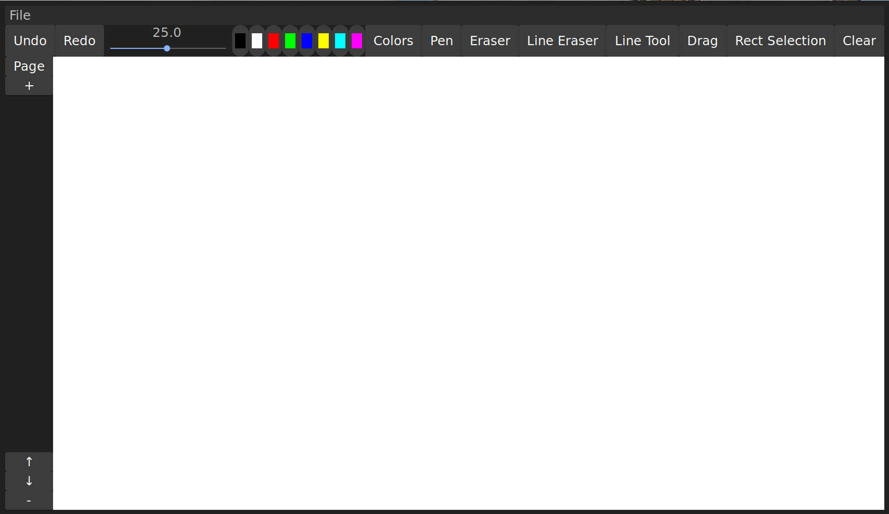

### Handwritten Notetaking Editor

##### Basic Interaction

1. File management

	`.png` images can be imported with `File` -> `Import png...`.

	The currently visible canvas can be exported as `.png` `File` -> `Export as png...`.

	The application state can be imported and exported in `.hnote` files using the actions `File` -> `Open...`, `Save...` and `Save as...`.
	
		Note that the application state will be overwritten.

2. Version control

	The drawing state of all pages can be reverted und redone with `Undo` and `Redo` at the top left.

	Deleted pages will be recreated if this was a previous or next step, depending on `Undo` or `Redo`.

3. Page control

	Page manipulation can be found on the most left.

	Pages can be created with `+` and deleted with `-`.

	`-` deletes the currently displayed page.

	Page repositioning is possible by using `↑` and `↓`.

4. Drawing

	The `Pen` tool is selected when the application is opened.

	Colors can be either selected by clicking on the predefined previews or `Colors`, to open the color widget dialog.

		

	The current color can be gradually adjusted with the channels: red, green, blue and alpha (top to bottom).

	A preview of the color is displayed at the top of the dialog.

	Drawing size can be adjusted with the visible slider.

5. Erasing

	`Eraser` erases parts of the lines.

	`LineEraser` erases the whole line.

6. Extended Functionality

	Lines or images can be repositioned with the `Drag` tool.

	The closest element to the pointer can be repositioned.

		Image handles are at the top left of the image.

	Straight lines in the selected color can be drawn with `LineTool`.

	The current canvas can be cleared with `Clear`. Images are not effected.

##### Features

- [x] Basic drawing functionality (thin, medium, bold)
	- [x] The user can select different brush sizes
	- [x] The user can select the color of the brush (predefined colors, but also custom color possible)
	- [x] The brush color's transparency can be set by the user to allow for a text marker behavior (content under the text marker still visible, 'shines through').
	- [x] Support for drawing straight lines
- [x] Basic erasing functionality
	- [x] Similar to drawing, but removes previously drawn content where applied (does not remove complete strokes or elements, just parts where the eraser brush was applied)
	- [x] Image elements are not affected by the eraser.
	- [x] User can select different sizes
- [x] Pages of the document can be rearranged, meaning that their order can be changed.
- [x] Images can be included as elements on the pages.
	- [ ] Images can be scaled arbitrarily on the page.
	- [x] Images can be positioned arbitrarily on the page.
	- [x] Images can overlap and be overdrawn (think of gluing a photo onto a notebook page)
- [x] Page content elements (images & brush strokes) can be selected, repositioned on the page, or deleted.
	- [x] Elements can be selected by a rectangular selection tool. User can drag a rectangle over the elements they wish to select. All elements that intersect with the rectangle are then selected.
- [x] User can undo/redo previous actions (history of document changes)
- [x] The notebook document can be saved to a custom file format and reloaded into the application from such files (so the user can continue working on a previously created document after closing and relaunching the application).
- [x] The notebook document can be exported as a series of image files (image resolution selectable by user).

##### Setup (on Linux)

1. `git clone` this repo
2. Install [rustup](https://www.rust-lang.org/tools/install), [gtk3](https://www.gtk.org/), [gcc](https://gcc.gnu.org/) and [pkgconfig](https://www.freedesktop.org/wiki/Software/pkg-config/) on your system
3. Run this application with `cargo run`
4. `cargo doc --open` opens technical documentation in the browser